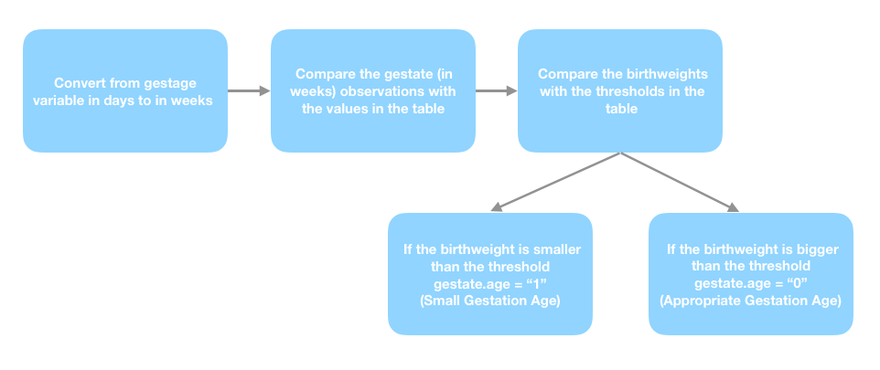

   
```{r setup, include=FALSE}

knitr::opts_chunk$set(
	echo = TRUE,
	message = FALSE,
	warning = FALSE,
	library(grid), 
	library(shadowtext))

# install.packages("pacman")  ## you should download this package firstly! It is off because of knitting error

pacman::p_load(readr,         # import/export
               tidyverse,     # tidydataset and viz
               magrittr,      # pipe operator
               naniar,        # assess and visualize missing values
               mice,          # missing data imputation
               dplyr,         # data manipulation
               GGally,        # extension to ggplot2
               finalfit,
               usethis,
               devtools,
               psych,
               ltm,           # point biseries cor
               VIM,
               plotly,        # intercative tables
               nortest,
               car, 
               Hmisc,          # multivariate histogram
               purrr,
               reshape2,       # for melt function
               MVN,            # multivariate normality test
               mvoutlier,      # outlier detection
               kableExtra,     #advanced tables
               tableone,
               Matching,       ## PS matching
               survey,         ## Weighted analysis
               ggplot2
)

```

<br>

<br>

```{markdown}
The aim is to examine whether administration at least one dose of the mRNA-based vaccine in pregnancy is associated with shorter gestational age at birth. 
```

<br>

# Data Summary

**Garbage in, garbage out!**

The most important thing is to understand what is the data structure, in this manner we need to ask a lot of questions to the data set. 

  - Is the data properly defined?
  
  - Are there any outliers and missing observations?
  
The data set has 12590 observations and 20 variables. All variables are entered as numeric variables. 

<br>

```{r include=FALSE}
data <- read_csv("mRNA_vaccine test data.csv")
```

```{r echo=FALSE}
as.data.frame(data) %>% str()
```

<br>

Factor variables are fixed for the reliable analysis. Also, the data set has possible outliers and missing values that have to be examined. 

<br>

```{r echo=FALSE}
data %<>% mutate(across(c(2, 4, 5, 6, 7, 8, 10, 11, 12, 13, 16, 17, 20), as.factor))
as.data.frame(data) %>% str()
attach(data)

dist.vac <-data %>% dplyr::select(vaccination) %>% table()
n.nonvac <- dist.vac[1]
n.vac <- dist.vac[2]

data.cont = data[,c(9,14,15,18,19)] 
```


<br>

## Outliers

Outliers can have many causes, such as: measurement or input error, missing values, true outlier observation. There is no precise way to define and identify outliers in general because of the specifics of each dataset. Instead, researcher and an expert, must interpret the raw observations and decide whether a value is an outlier or not. The data set examined as univariate and multivariate perspective in order to create a road map.

<br>

### Univariate Outlier Evaluation

Univariate outlier check is done with boxplot. It is seen that each variable has outliers both upper and lower level. (*This is an interactive plot, you can add or exclude variables in a one click on variable label, and you can see the points and thresholds on the plot*)


```{r echo=FALSE, message=FALSE, warning=FALSE}
data.scale = scale(data.cont) %>% as.data.frame()

fig1 <- plot_ly(y = ~data.scale[,1], name = 'depression_severity', type = "box")
fig1 <- fig1 %>% add_trace(y = ~data.scale[,2], name = 'bmipp')
fig1 <- fig1 %>% add_trace(y = ~data.scale[,3], name = 'age')
fig1 <- fig1 %>% add_trace(y = ~data.scale[,4], name = 'birthweight')
fig1 <- fig1 %>% add_trace(y = ~data.scale[,5], name = 'gestage')
fig1

```


```{r include=FALSE}
## possible outliers

d1 = boxplot(depression_severity)$out
d1.obs = which(depression_severity %in% d1)

d2 = boxplot(bmipp)$out
d2.obs = which(bmipp %in% d2)

d3 = boxplot(age)$out
d3.obs = which(age %in% d3)

d4 = boxplot(birthweight)$out
d4.obs = which(birthweight %in% d4)

d5 = boxplot(gestage)$out
d5.obs = which(gestage %in% d5)

d.obs <- list(d1.obs, d2.obs, d3.obs, d4.obs, d5.obs)    # with duplicate

duplicated <- d.obs %>% unlist() %>% duplicated()

duplicated.v <- unlist(d.obs)[duplicated]    # duplicated observation values

duplicated.p <- unlist(d.obs)[duplicated]    # duplicated obs pin number

d.obs <- d.obs %>% unlist() %>% unique()     # without duplicate

# possible outliers in vaccinated observations 

pouts.vac <- data[d.obs,] %>% filter(vaccination == 1)
  

n.pouts <- d.obs %>% length()       # tot numb of outliers
           
n.pouts.vac <-  pouts.vac %>% nrow()   # tot numb of outliers in vaccinated obs
                
n.pouts.nonvac = n.pouts - n.pouts.vac       # tot numb of outliers in nonvaccinated obs               


pouts.tot.rate <- round(n.pouts/12590*100, digits = 2)  

pouts.vac.rate <- round(n.pouts.vac/n.vac*100, digits = 2) 

pouts.nonvac.rate <- round(n.pouts.nonvac/n.nonvac*100, digits = 2)   

```

The outliers are examined. An observation can be observed as an outlier in more than one variable. For this reason, the intersection must be checked (7 intersecting observations were counted only once). Total number of outliers are equal to `r n.pouts`, `r n.pouts.vac` of these observations belong to the vaccinated observations. `r n.pouts.nonvac` of these observations belong to the non-vaccinated observations. 

At this point, the important question is **what is the rate of vaccinated and non-vaccinated observations in the data?** The data set has `r n.vac` vaccinated, and `r n.nonvac` non-vaccinated observations. When we compare each group within itself, it is seen that, in case of removing outliers from the data set, `r pouts.tot.rate`\% of total observations are lost. Although this rate is small, it is a significant loss because the rate also equal to `r pouts.vac.rate`\% of vaccinated and `r pouts.nonvac.rate`\% of non-vaccinated observations. 

<br>

### Multivariate Outlier Evaluation

Multivariate outlier check is done by using spatial signs which is fast algorithm for identifying multivariate outliers in high-dimensional and/or large data sets. The computation of the distances is based on Mahalanobis distances. 


```{r echo=FALSE}
out <- sign1(na.omit(data.cont))

pouts <- which(out$wfinal01 == 0) # possible multivariate outliers

n.pouts.multi <- pouts %>% length()

n.pouts.multi.vac <- data[pouts,] %>% filter(vaccination == 1) %>% nrow()

n.pouts.multi.nonvac <- data[pouts,] %>% filter(vaccination == 0) %>% nrow()


pouts.multi.tot.rate <- round(n.pouts.multi/12590*100, digits = 2) 

pouts.multi.vac.rate <- round(n.pouts.multi.vac/n.vac*100, digits = 2)

pouts.multi.nonvac.rate <- round(n.pouts.multi.nonvac/n.nonvac*100, digits = 2) 

```

The data set has `r n.pouts.multi` possible outliers from multivariate perspective. When we compare each group within itself, it is seen that, in case of removing outliers from the data set, \%`r pouts.multi.tot.rate` of total observations are lost. They are equal to `r pouts.multi.vac.rate`\% of vaccinated and `r pouts.multi.nonvac.rate`\% of non-vaccinated observations. 

<br>

### 🎯 Decision

**The decision of which outliers to be eliminated should be made together with the domain expert.** In this case study, the intersection of outliers that is both univariate and multivariate possible outlier set are selected as final outliers.


```{r include=FALSE}
m.out <- which(d.obs %in% which(out$wfinal01 == 0))  # the intersection of univariate and multivariate outliers

n.n.out <- m.out %>% length()

out.vac.fin <- data[m.out,] %>% filter(vaccination == 1) %>% nrow()

out.nonvac.fin <- data[m.out,] %>% filter(vaccination == 0) %>% nrow()
```

In the final case, `r n.n.out` of outliers are eliminated which belong to non-vaccinated observations. 

<br>

## Missing Values

```{r include=FALSE}
data2 <- data[-m.out,]    # the data set after outlier elimination

missing.values.var <- data2 %>% is.na() %>% colSums() 
  
missing <- missing.values.var[which(missing.values.var>0)]  

missing.rate <- missing/12590*100

```

After the outlier elimination, the missing values should be checked and examined. It can be seen that, $98.25\%$ of gestational week of vaccination observation is missing. This rate also equal to the number of non-vaccinated observations. As expected, a non-vaccinated observation does not have a vaccination week information. For this reason, gestational week of vaccination variable is excluded from the data set before imputation.

```{r echo=FALSE}
kbl(missing.rate, col.names = 'Missing Value(%)') %>%
  kable_styling(bootstrap_options = "striped", full_width = F, position = "float_right")
```

Under the assumption that data were missing at random (MAR), the missing values are imputed. For imputation, Generates Multivariate Imputations by Chained Equations (MICE) package is used that creates multiple imputations for multivariate missing data. The method is based on Fully Conditional Specification, where each incomplete variable is imputed by a separate model. In this study, m is selected as 5 because the substantive conclusions are unlikely to change as a result of raising  m beyond $m=5$ [@buuren].  

In the beginning of imputation step, the data set is splitted into two group which are vaccinated and non-vaccinated because of interactions. Each group is imputed and then combined the imputed data sets [@buuren].

After the normality test, Bayesian linear regression is used for bmipp and birthweight variables which are normally distributed. Predictive mean matching is used for other variables for multiple imputation.

<br>

```{r echo=FALSE, cache = T}
norm <- data2 %>% dplyr::select(depression_severity, bmipp, age, birthweight, gestage) %>% 
  mvn() 

norm$univariateNormality
```

```{r include=FALSE}
### imputation

data.vac <- data2 %>% filter(vaccination == 1)
  
data.nonvac <- data2 %>% filter(vaccination == 0)


vac.imp <- mice(data.vac[,-c(1,2,4)], seed = 18,  m = 5, method = c(rep('pmm',10), "norm", rep('pmm',3), "norm", rep('pmm',2)))  ## exclude unnecessary variables

nonvac.imp <- mice(data.nonvac[,-c(1,2,3)], seed = 18,  m = 5, method = c(rep('pmm',10),"norm", rep('pmm',3),"norm", rep('pmm',2))) ## exclude unnecessary variables


## for easy to take pin variable

vac.rep <- data.vac[,c(1,2,4)] %>% slice(rep(1:n(), 5))
  

nonvac.rep <- data.nonvac[,c(1,2,3)] %>% slice(rep(1:n(), 5))

## cbind sets and combine with unused variables

set1 <- vac.imp %>% complete("long") %>% cbind(vac.rep) ## add excluded variables

set2 <- nonvac.imp %>% complete("long") %>% cbind(nonvac.rep)  ## add excluded variables


merged.data <- full_join(set1,set2) %>% 
               arrange(.imp, pin) %>% as_tibble()
```

<br>

### 🎯 Decision 

Except for the gestational week of vaccination variable, all missing observations are imputed. 

<br>

## Data Modifications

In this study, the association between vaccine and small gestational age at birth is examined. For this purpose, some of variables are converted for usage and some new variables are created. 

At this point, gestage (in days) values are converted from day to week.  

<br>

### Gestatinal Week of Vaccination

As mentioned before, gestational week of vaccination variable has a lot of missing value because the data set has a lot of non-vaccinated observations. In order to use this important variable in the analysis both vaccinated and non-vaccinated group, the continuous variable converted to factor variable by using trimesters. This transformation also provides ease of interpretation.

```{r echo=FALSE}
gw <- data.frame(value = c(0,1,2,3),
           trimesters = c("NA","0 - 13 weeks", "14 - 26 weeks", "27 - 40 weeks"), 
           meaning = c(" No vaccination", "vaccination in 1st trimester","vaccination in 2nd trimester", "vaccination in 3rd trimester"))

kbl(gw) %>%
  kable_styling(bootstrap_options = "striped", full_width = F, position = "left")
```


```{r include=FALSE}
trimesters <- merged.data  %>% with(ifelse(gestationalweekofvaccination > 0 & gestationalweekofvaccination <= 13, 1, 
                  ifelse(gestationalweekofvaccination >=14 & gestationalweekofvaccination <= 26 , 2, 3))) 

trimesters[is.na(trimesters)]<- 0   ## convert NA values to 0, 0 represents no info about trimester (non-vaccinated)

merged.data <- merged.data %>% mutate(trimesters = as.factor(trimesters))
```

<br>

### Determination of Small/Short Gestational Age (SGA)

Small for gestational age (SGA) newborns are those who are smaller in size than normal for the gestational age, most commonly defined as a weight below the 10th percentile (threshold) for the gestational age (MedlinePlus). In this study, SGA determination is done with the  proposed table [@talge2014united]. Thus, a new factor variable gestatinal.age ($SGA = 1$, $AGA = 0$) is generated using the birthweight and gestage variables. Also, the variable gestage (in days) is converted to week format for computational convenience.


```{r include=FALSE}
# convert from gestage in days to gestage in weeks

merged.data <- merged.data %>% mutate(gestage.week = round((merged.data$gestage)/7))
```

```{r echo=FALSE}
GAthreshold = tibble(GAweeks = (22:44), 
                         threshold = c(354, 416, 473, 529, 597, 677, 770, 882, 1018, 1166, 1335, 1538, 
                                       1772, 2021, 2261, 2477, 2665, 2810, 2904, 2958, 2985, 2981, 2952))

GAthreshold

```


```{r include=FALSE}
## vector of gestational age classification based on
# "United States Birth Weight Reference Corrected For Implausible Gestational Age Estimates"

gestational.age = c()       
for (i in 1:nrow(merged.data)){
   k <- which(merged.data$gestage.week[i] == GAthreshold$GAweeks)
   
   if(merged.data$birthweight[i] < GAthreshold$threshold[k]){
     gestational.age[i] <- 1 }    # small for gestational age (SGA)
     else {
       gestational.age[i] <- 0}}  # appropriate for gestational age (AGA)
    
table(gestational.age)  

merged.data <- merged.data %>% mutate(gestational.age = as.factor(gestational.age))
```

<br>

```{r pressure, echo=FALSE, out.width = '100%'}

```

<br>

# Method

It is seen that, the vaccination variable has unbalanced groups as vaccinated and non-vaccinated. For this reason, inverse probability of treatment weighting (IPTW) is used to balance groups using a propensity score matching weight approach. 

The association between vaccination and small gestational age at birth is examined with logistic regression because the gestational.age variable is binary. In this manner, gestatinal.age and vaccination variables are considered as response and explanatory variables, respectively. The logistic regression is applied both before and after IPTW for comparison purpose.

<br>

## The Summary of Variables Before/After Inverse Probability of Treatment Weighting (IPTW)

In the IPTW method, the propensity score is defined as the probability of being vaccinated. It is obtained from a logistic regression model where the vaccination variable is considered as a binary dependent variable and the following list of covariates is considered as the independent variables.

<br>

```{r echo=FALSE}
merged.data.rev <- merged.data[,-c(2,3,17,18,20,23,24)] 

con.var <- c("ibu_prepreg","paracet_prepreg","opioid_prepreg","diabetes","depression_severity",
          "pain","headache","pelvicgirdlepain","smoking","bmipp","age","parity","education",
          "malform","sarscov2_infection")

con.var
```

<br>

Balance before and after IPTW assessed using the standardized mean difference (SMD) between vaccination groups. A SMD of greater that 0.1 is usually considered to indicate a significant imbalance[@austin2009balance].  

After the missing data imputation, 5 imputed data sets are obtained. 
In the next, firstly, we present results for the first imputation data sets ($m = 1$). Then, the combination of all imputed data set results are presented.


Unweighted distribution of baseline characteristics of the study population for $m=1$. 

<br>

```{r echo=FALSE}
merged.data.rev1 <- merged.data.rev %>% filter(.imp==1)

tab.un.adj1 <- CreateTableOne(vars = con.var, strata = "vaccination", 
                              data =merged.data.rev1,test = FALSE) 

print(tab.un.adj1, smd=TRUE)
```


<br>

It is concluded that 7 variables have a SMD of greater than 0.1.

<br>

```{r echo=FALSE}
### imbalance covariates 
as.data.frame(ExtractSmd(tab.un.adj1)) %>%  filter(ExtractSmd(tab.un.adj1)>0.1)

```

<br>

## Propensity Score Estimation

For $m = 1$, IPTW performed for a set of the selected covariates using the propensity score. Logistic regression is fitted to estimate the probability of vaccination groups.

<br>

```{r echo=FALSE}
ps.model<-glm(formula = vaccination ~  ibu_prepreg + paracet_prepreg + opioid_prepreg + diabetes + 
                        depression_severity + pain + headache + pelvicgirdlepain + smoking + bmipp + 
                        age + parity + education + malform + sarscov2_infection,
              family  = binomial(link = "logit"), data = merged.data.rev1)

ps.model
summary(ps.model)

```

```{r echo=FALSE}
## Predicted probability of being assigned to vaccinated (vaccination = 1) for glm result
merged.data.rev1$propensity_vac <- predict(ps.model, type = "response")

## Predicted probability of being assigned to no vaccinated 
merged.data.rev1$propensity_novac  <- 1 - merged.data.rev1$propensity_vac
```

```{r echo=FALSE}
merged.data.rev1$ate <- ifelse(merged.data.rev1$vaccination == 1, merged.data.rev1$propensity_vac, merged.data.rev1$propensity_novac)
```

```{r echo=FALSE}
merged.data.rev1$prop.min <- pmin(merged.data.rev1$propensity_vac,merged.data.rev1$propensity_novac )

## Matching weight
merged.data.rev1$ps_weights <- merged.data.rev1$prop.min / merged.data.rev1$ate

```

<br>

The matching weight method [@li2013weighting] is used for creating weights. The matching weight is defined as the smaller of the predicted probabilities of receiving or not receiving the treatment (vaccination) over the predicted probability of being assigned to the patient is actually in. After weighting, all the standardized mean differences are below 0.1.

```{r echo=FALSE}
## Weighted data
merged.data.rev1_svy <- svydesign(ids = ~ 1, data = merged.data.rev1, weights = ~ ps_weights)

```

<br>

```{r echo=FALSE}
#### SMD table with weight after IPTW 

tabweighted1 <- svyCreateTableOne(vars = con.var, strata = "vaccination", data = merged.data.rev1_svy, test = FALSE)

## Show table with SMD
print(tabweighted1, smd = TRUE)
```

<br>

In the next table and figure, after and before IPTW results of baseline characteristics and SMD values of considered independent variables are presented. 

<br>

```{r echo=FALSE}
## Construct a data frame containing variable name and SMD from all methods
dataPlot <- data.frame(Variable   = rownames(ExtractSmd(tab.un.adj1)),
                       Unadjusted = as.numeric(ExtractSmd(tab.un.adj1)),
                       Weighted   = as.numeric(ExtractSmd(tabweighted1))    )

## Create long-format data for ggplot2
dataPlotMelt <- melt(data          = dataPlot,
                     id.vars       = c("Variable"),
                     variable.name = "Method",
                     value.name    = "SMD")

## Order variable names by magnitude of SMD
varNames <- as.character(dataPlot$variable)[order(dataPlot$Unadjusted)]

## Order factor levels in the same order
dataPlotMelt$variable <- factor(dataPlotMelt$Variable,
                                levels = varNames)

## Plot using ggplot2 for SMD 
ggplot(data = dataPlotMelt,
       mapping = aes(x = Variable, y = SMD, group = Method, color = Method)) +
  ggtitle("Standardised mean difference of confounding variables before and after IPTW") +
  geom_line() +
  geom_point() +
  geom_hline(yintercept = 0.1, color = "black", size = 0.1) +
  coord_flip() +
  theme_bw() +
  theme(legend.key = element_blank())


## Column bind tables
resCombo <- cbind(print(tab.un.adj1,  printToggle = FALSE,smd=TRUE),
                  print(tabweighted1,   printToggle = FALSE,smd=TRUE))

## Add group name row, and rewrite column names
resCombo <- rbind(Group = rep(c("No Vaccination","Vacination","SMD"), 2), resCombo)
colnames(resCombo) <- c("Unweighted","","","Weighted","","")
print(resCombo, quote = FALSE)


```


<br>

This analysis is conducted before and after IPTW for $m = 1$. 

The logistic regression results for the main model (gestation.age and vaccination variables) before IPTW are given as follows.  

<br>

```{r echo=FALSE}
## Unmatched model (unadjusted)
glm.unmatched <- glm(formula = (gestational.age == 1) ~  vaccination,
                    family  = binomial(link = "logit"),
                    data    =  merged.data.rev1)

summary(glm.unmatched)

```

<br>

The logistic regression results for the main model after IPTW results are given as follows. 

<br>


```{r echo=FALSE}

### weighted logistic regression with mw
glm.weighted <-glm(formula = (gestational.age == 1) ~  vaccination, weights = ps_weights,
    family  = quasibinomial(),
    data    =  merged.data.rev1)
summary(glm.weighted)
```

<br>

## Final Analysis

In this part, the analysis conducted with all imputed data sets (m is selected 5) after IPTW, and the results are combined with pool function. 

<br>

```{r echo=FALSE}
## Results for all imputed data sets before IPTW
final.fit.before <- merged.data.rev %>% 
  group_by(.imp) %>% 
  do(model = glm(formula = (gestational.age == 1) ~  vaccination,
                    family  = binomial(link = "logit"),data=merged.data.rev) ) %>% 
  as.list() %>% 
  .[[-1]] %>% 
  pool()

ffit1 <- final.fit.before %>% summary()
print(final.fit.before)
or1 <- ffit1$estimate %>% exp()
paste('Odd ratio before IPTW:' , round(or1[2],2))

```

<br>

The effect of vaccination variable on the response variable gestational.age is explained using an odds ratio (OR). Since $OR>1$, vaccinated observations has a higher odds of having the SGA compared with the non-vaccinated group. 

Based on the above results, since OR before IPTW is 6.26, vaccinated observations have more risk for SGA event than non-vaccinated observations. This result based on imbalanced data set.

In the next, the analysis conducted with all imputed data sets (m is selected 5) after IPTW, and the results are combined with pool function.

<br>

```{r echo=FALSE}
## Results for all imputed data sets after IPTW

source("pre_res.R")
final.fit <- merged.data.rev %>% 
  group_by(.imp) %>% 
  do(model = pre_res(merged.data.rev)) %>% 
  as.list() %>% 
  .[[-1]] %>% 
  pool()
```

```{r echo=FALSE}
ffit2 <- final.fit %>% summary()
```

```{r echo=FALSE}
or2 <- ffit2$estimate %>% exp()
print(final.fit)
paste('Odd ratio after IPTW:' , round(or2[2],2))
```

<br>


Based on the above results, since OR after IPTW is 1.29, vaccinated observations have slightly more risk for SGA event than non-vaccinated observations. This result based on balanced data set. Hence, it is observed that OR decreases significantly using IPTW.

<br>

# Limitations

- The number of vaccinated observations are limited, and also observations were predominantly vaccinated during the second and third trimesters.

- In the data set, previous history of preterm or SGA at birth were not available, it can be important for prosperity. Family-based studies showed that gestational age at birth is partially (from 25% to 40%) determined by genetic factors [@clausson2000genetic]. 

- Because of the time constraint, a lot of method could not be applied such as relative risk ratios, sensitivity analysis, possible machine learning techniques.

- The lack of domain knowledge for outlier and missing value evaluation. 

<br>

# Packages and Details

In this study, R statistical software[@r] (version 4.2.0) is used. The interactive report is prepared with R Markdown. The packages used in the study are listed below.

```{markdown}
readr, tidyverse, magrittr, naniar, mice, dplyr, GGally, finalfit, usethis, devtools, psych, ltm, VIM, plotly, nortest, car, Hmisc, purrr, reshape2, MVN, mvoutlier,  kableExtra, grid, shadowtext,  tableone, Matching, survey, ggplot2
```

<br>

# 🚀 References


